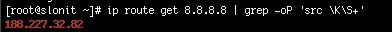
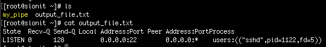
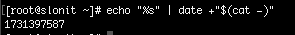
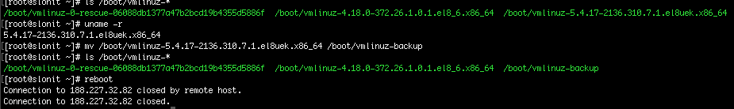
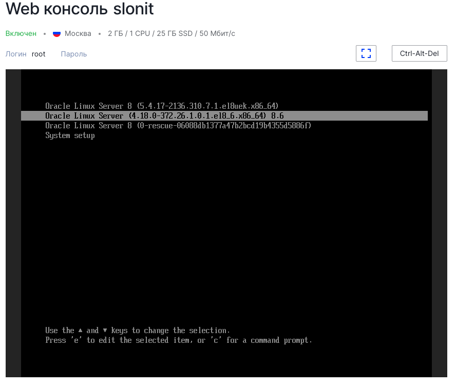
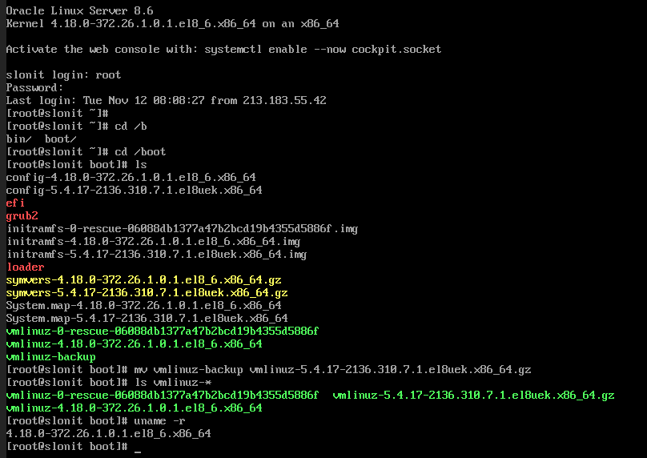
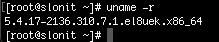

## Домашнее задание №1

### 1. Узнать IP-адрес интерфейса, подключенного к сети Интернет

```bash
ip route get 8.8.8.8 | grep -oP 'src \K\S+'
```
Эта команда возвращает IP-адрес, с которого происходит выход в Интернет. `188.227.32.82`

    

### 2. Создать именованный пайп (named pipe) и вывести в файл через него вывод команды `ss -plnt`

Создать именованный пайп:

```bash
mkfifo my_pipe
```

Вывод команды `ss -plnt` через пайп в файл:

```bash
ss -plnt > my_pipe &
cat < my_pipe > output_file.txt
```
В результате файл `output_file.txt` будет содержать вывод команды `ss -plnt`.

    


### 3. Архивировать через именованный пайп

Создание именованного пайпа:

```bash
mkfifo my_archive_pipe
```

Архивирование содержимого файла `/var/log/messages` в формате TAR:

```bash
cat /var/log/messages > my_archive_pipe &
tar -cf archive.tar -C / -T my_archive_pipe
```
В результате получится файл `archive.tar`, содержащий содержимое `/var/log/messages`.


### 4. Вывести дату в unixtime

Отправить формат даты через пайп:

```bash
echo "+%s" | date +"$(cat -)"
```

    


### 5. Использование HEREDOC для записи многострочного сообщения в файл

Пример записи многострочного текста в файл:
```bash
cat << EOF > multiline_message.txt
первое сообщение.
второе сообщение.
сообщение 3.
EOF
```
Файл `multiline_message.txt` будет содержать записанные строки.

---

### Задание повышенного уровня сложности: перемещение ядра и восстановление системы

Перемещение или переименование ядра:
1. Найдите текущий файл ядра:
   ```bash
   ls /boot/vmlinuz-*
   ```
2. Переименуйте ядро:
   ```bash
   mv /boot/vmlinuz-<version> /boot/vmlinuz-backup
   ```
3. Перезагрузите систему:
   ```bash
   reboot
   ```

    


#### Восстановление системы:
1. Через версию 4:
   - При загрузке, в меню GRUB использую другой образ ядра.
   - восстанавливаю ядро из backup:

     ```bash
     mv /boot/vmlinuz-backup /boot/vmlinuz-<version>
     grub2-mkconfig -o /boot/grub2/grub.cfg
     reboot
     ```

    

    

    Проверяем версию.

    

2. Аналогичным образом через Emergency Mode 

