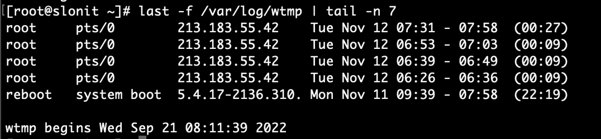
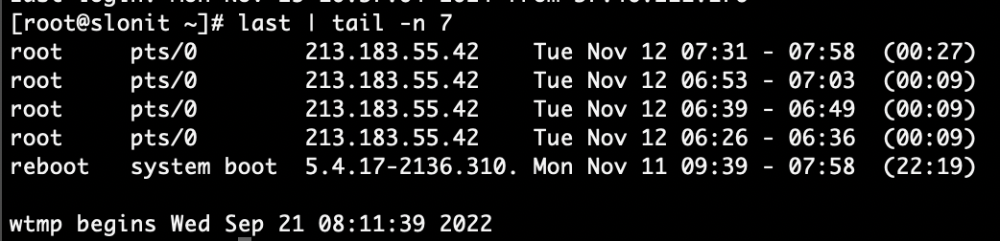
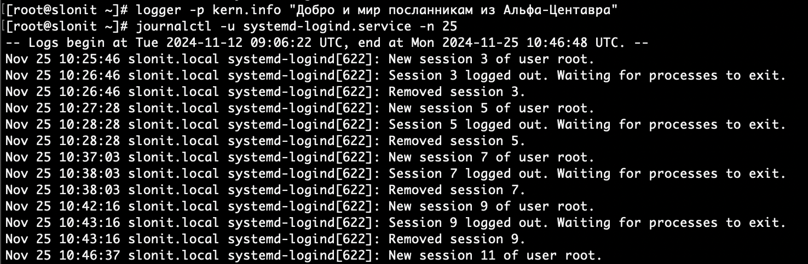
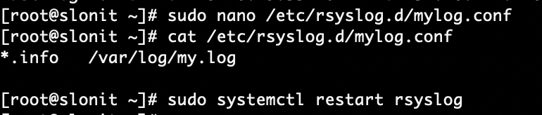

### 1. Отразить 7 последних строк из:
- wtmp
- last

`last -f /var/log/wtmp | tail -n 7`



`last | tail -n 7`



### 2. При помощи `logger` записать в общий журнал послание добра и мира посланникам из Альфа-Центавра с facility kernel

`logger -p kern.info "Добро и мир посланникам из Альфа-Центавра"`

`Nov 25 10:46:48 slonit.local root[173838]: Добро и мир посланникам из Альфа-Центавра`

### 3. Посмотреть последние 25 строчек лога сервиса `systemd-logind`



### 4. Создать конфигурацию `syslog` для отправки сообщений уровня `info` в файл `/var/log/my.log`

Открыть файл конфигурации syslog:
`sudo nano /etc/rsyslog.d/mylog.conf`

Добавить следующие строки:
`*.info   /var/log/my.log`

Перезапустить службу:
`sudo systemctl restart rsyslog`



### 5. Все события `ssh` записывать параллельно в отдельный файл, производить ротацию каждые сутки или по размеру (не более 1 мегабайта), всего 10 файлов в ротации.

Настроить конфигурацию: `sudo nano /etc/rsyslog.d/ssh.conf`

Добавить:
```bash
if $programname == 'sshd' then /var/log/ssh.log
& stop
```
Настроить ротацию логов:
`sudo nano /etc/logrotate.d/ssh`

Добавить:
```
/var/log/ssh.log {
    daily
    size 1M
    rotate 10
    compress
    missingok
    notifempty
    create 0640 root adm
}
```
Перезапустить службы:

`sudo systemctl restart rsyslog`

`sudo logrotate -f /etc/logrotate.d/ssh`

### 6. Вывести сообщения с последнего запуска системы. Вывести сообщения не старше одного часа.

`journalctl --boot`

`journalctl --since "1 hour ago"`

сохраним в `1h.txt` и `boot.txt`